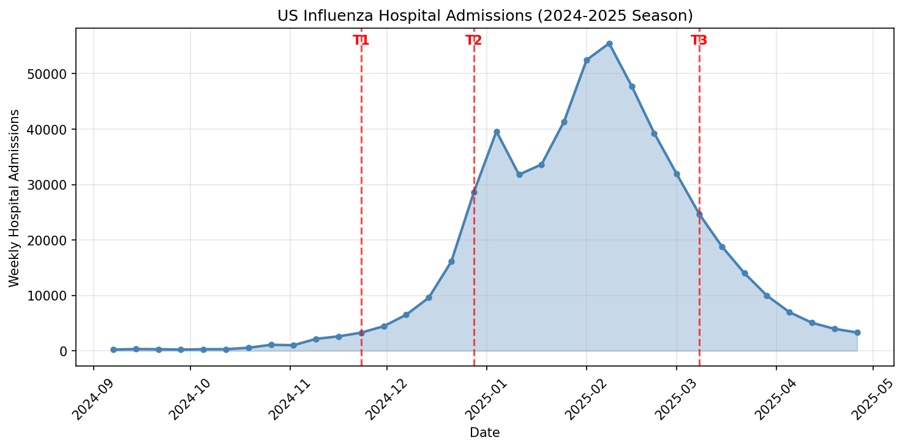

# Session 5: Forecast Pipeline and Application

Full forecasting workflow using the [EpyForecast app](https://www.epydemix.org/tools) to calibrate and project influenza hospitalizations.

---

## Overview

In this session, you will use the **EpyForecast** application to forecast US influenza hospital admissions during the 2024-2025 season. You'll run forecasts at three different time points and explore how various calibration settings affect forecast performance.

## Data

The file `data/US_Flu_2024_2025.csv` contains weekly influenza hospital admissions for the United States from September 2024 through April 2025.

**Source:** [data.cdc.gov](https://data.cdc.gov)

*Red dashed lines mark the three forecast dates (T1, T2, T3).*

To explore the data interactively, see [data/plot_flu_data.ipynb](data/plot_flu_data.ipynb).

---

## Exercise: Forecasting with EpyForecast

### Objective

Generate forecasts at three time points during the 2024-2025 flu season and evaluate how calibration settings impact forecast accuracy.

### Forecast Dates

You will run forecasts at these three dates, representing different phases of the epidemic:

| Time Point | Date | Epidemic Phase |
|------------|------|----------------|
| T1 | 2024-11-23 | Early growth phase |
| T2 | 2024-12-28 | Rapid growth (pre-peak) |
| T3 | 2025-03-08 | Declining phase |

### Tasks

#### Part 1: Baseline Forecasts

1. Load the US flu data into EpyForecast
2. Run forecasts at each of the three time points using **default parameters** (4-week forecast horizon)
3. Compare forecasts to actual data and note the uncertainty range (credible intervals)

#### Part 2: Experiment with Calibration Settings

Starting from T2 (2024-12-28), experiment with changing the following settings and observe how they affect the forecast:

**ABC Algorithm**
- Try different ABC strategies (rejection vs SMC)
- Vary the number of particles
- Change the number of generations (for SMC)

**Distance Metric**
- Default is WMAPE (Weighted Mean Absolute Percentage Error)
- Try RMSE or other available metrics
- How does the choice of metric affect which simulations are accepted?

**Model Structure**
- Default is SEIR-H
- Try the alternative VSEIAR-H model
- How does model complexity affect forecast uncertainty?

**Prior Distributions**
- Adjust priors for key parameters:
  - R0 (basic reproduction number)
  - Background immunity
  - Probability of hospitalization in 65+
- Try narrower vs wider priors
- What happens with uninformative vs informative priors?

**Forecast Horizon**
- Default is 4 weeks ahead
- Try extending to 6 or 8 weeks
- How does uncertainty grow with longer horizons?

### Discussion Questions

1. **Forecast timing**: How does forecast accuracy differ across the three time points? Why might early-phase forecasts be more uncertain?

2. **Parameter sensitivity**: Which calibration settings have the largest impact on forecast quality?

3. **Computational trade-offs**: How do more particles/generations improve forecasts? What are the computational costs?

4. **Model selection**: Does VSEIAR-H produce better forecasts than SEIR-H for this data?

5. **Forecast horizon**: How does uncertainty grow as you extend the forecast horizon?

---

## Resources

- [Epydemix Documentation](https://epydemix.readthedocs.io/)
- [Session 3: Calibration Tutorial](../session-3/python/02_calibration_tutorial.ipynb)
- [Session 4: Exercise 4 - Calibration with Interventions](../session-4/solutions/python/exercise_4_seir_calibration.ipynb)
